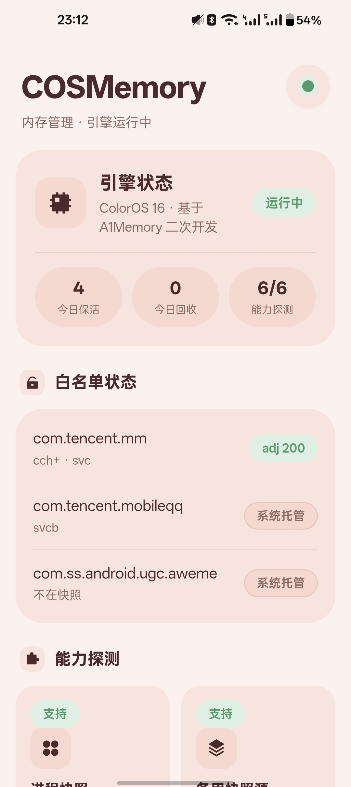
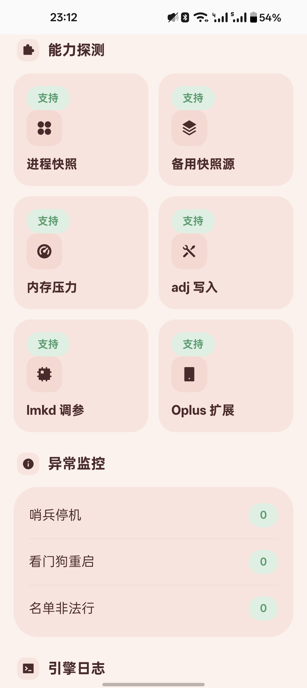

<div align="center">
<h1>COSMemory 内存管理</h1>


<p><b>Android 12+ 通用引擎（ColorOS 15/16 实测）· 白名单保活 + 名单外智能回收 · KernelSU / Magisk 模块</b></p>
<p>作者：<b>是你吗薰儿</b> · 基于 <a href="https://github.com/OneB1ank/A1Memory">HChai/OneB1ank 的 A1Memory</a> 二次开发 (GPLv3) · 代码仓库：<a href="https://github.com/wzcawzc123/COSMemory">wzcawzc123/COSMemory</a></p>
</div>

**主界面 · 引擎状态与白名单**


**能力探测 · 异常监控**


## 🤔 这是什么

一个**认真做验证**的 ColorOS 内存管理模块。切回微信/QQ 总是冷启动转圈？后台 App 被系统随手杀掉？COSMemory 给你一份**可编辑的白名单**——名单内的应用退后台后稳稳保住，名单外的该清就清。

与常见的「玄学内存优化包」不同，本模块的每一项行为都可以被验证：引擎动作全程落日志、面板实时可见、保护机制（哨兵/看门狗/回滚）全部经过真机破坏性测试。

## ✨ 功能

| 功能 | 说明 |
|---|---|
| 🛡 **白名单保活** | `WHITE` 名单内应用退后台后，缓存态 adj 施压式拉至 200（系统调走就写回）——切回去更少冷启动 |
| 🧹 **智能回收** | `KILL` 名单点名清理流氓子进程，单轮上限 5 个 + 60 秒冷却，防「杀疯了」 |
| 🚫 **整包封杀** | `FREEZE` 名单：杀掉并在冷却期内阻止拉起（出厂留空，自由配置） |
| 🛑 **哨兵保护** | 进程快照格式异常（解析率 <50%）→ 立即停机零写入，**宁停不错** |
| 🐕 **看门狗** | 引擎崩溃 30 秒内自动拉起，事件全程落日志 |
| 🔍 **能力探测** | 启动时探测 6 项系统能力（快照源/PSI/adj写入/lmkd/Oplus 扩展…），缺失项面板可见、功能自动降级 |
| 📱 **WebUI 面板** | KernelSU 内置浏览器直开，Vue3 单文件，只读状态面板——引擎与面板完全解耦，面板崩了不影响引擎 |
| ↩️ **完全可回滚** | 每个 adj 改动记录原始值，卸载自动还原，不留残留 |

## 🏗 工作原理

```
┌─ SLEEP（2s 轻探前台 / 60s 全量巡检）─────────────────────┐
▼                                                          │
SNAPSHOT   dumpsys activity lru 快照（12ms，不扫 /proc）    │
▼                                                          │
SENTINEL   解析率 <50% ？→ 哨兵停机（零写入，宁停不错） ────┤
▼                                                          │
POLICY     白名单 / 保护态 / 冷却 / 上限 → 决策动作行       │
▼                                                          │
EXECUTE    写 adj 前记原始值 · PID/cmdline 双校验 · 落日志 ─┘
```

**保护态永不触碰**：前台 / 可见 / 最近任务 / persistent 进程、白名单进程、系统进程——名单配错也杀不动系统。
**性能**：每轮全开销 ≤30ms（快照式架构，实测 `dumpsys` 12ms vs 遍历 `/proc` 3200ms）。

## 📱 WebUI 面板

KernelSU 管理器 → 模块详情 → 打开，五个区块：

- **顶部状态**：引擎运行状态（实时进程探测）+ 能力 x/6
- **Hero 卡**：今日保活纠正 / 今日回收 / 能力探测三枚药丸统计
- **白名单状态**：每个名单应用的实时 adj——`adj 200` 绿色 = 保活生效；「系统托管」= 处于服务/前台态，引擎按设计不干预
- **能力探测**：6 项系统能力的支持状态
- **异常监控 + 引擎日志**：哨兵停机 / 看门狗重启 / 名单非法行计数，日志尾部 50 行

面板 5 秒轮询、**纯只读**——所有 shell 调用只读不写，面板异常不影响引擎运行。

## 📦 安装

**KernelSU**：管理器 → 模块 → 从本地安装 `COSMemory-vX.X.zip` → 重启

**Magisk**：App → 模块 → 从本地安装（理论兼容，暂无实机验证）→ 重启

**防线组件 COSGuard（LSPosed）** —— zip 的 `assets/` 内附 APK，缺它只有被动保活，防线拦截不生效：

1. 解压 zip，安装 `assets/COSGuard-vX.X.apk`
2. LSPosed 管理器 → 模块 → 勾选 COSGuard，作用域勾「系统框架」
3. 重启；LSPosed 日志出现 `COSGuard loaded` 即生效

安装后：

1. 名单文件自动初始化到 `/sdcard/Android/COSMemory/名单列表.conf`
2. 引擎随开机自动运行（`service.sh` 拉起 + 看门狗守护）
3. 面板：模块详情页 → 打开

**卸载**：模块管理器直接卸载 → 自动还原所有 adj、清理配置目录，零残留。

## ⚙️ 配置

### 名单文件（核心配置）

路径：`/sdcard/Android/COSMemory/名单列表.conf` —— **改完下一轮自动生效（2~8 秒），无需重启**

```
{
# 白名单：退后台保活（可只写包名，自动覆盖其全部子进程）
WHITE com.tencent.mm
WHITE com.tencent.mobileqq

# 点名杀子进程：必须带 :进程后缀（杀整包请用 FREEZE）
KILL com.example.app:pushservice

# 整包封杀：杀掉并在冷却期内阻止拉起
FREEZE com.bloat.app
}
```

规则：
- 每行 `动作 包名[:进程]`，`#` 开头为注释
- **非法行自动跳过并计数**（面板可见），不会连坐导致整个模块失效
- `KILL` 必须带 `:后缀`；整包封杀用 `FREEZE`
- 出厂 KILL 名单**为空**——每条候选须逐条实测（历史教训：上游 2023 年名单在 2026 年已全部失效，见 [docs/kill-exclusions.md](docs/kill-exclusions.md)）

### 高级参数（`/data/adb/modules/COSMemory/config/memory.json`）

| 字段 | 默认 | 说明 |
|---|---|---|
| `keepAlive.adj` | `200` | 保活目标 adj（200 = 缓存区高位，lmkd 最后才动它） |
| `keepAlive.enforce` | `true` | 施压式纠正：系统调走后写回 |
| `reclaim.aggressive` | `false` | 激进回收档（PSI 触发按 adj 回收）——**二期功能，出厂关** |
| `reclaim.maxKillPerRound` | `5` | 单轮击杀上限 |
| `reclaim.cooldownSec` | `60` | 同一进程击杀冷却 |
| `freeze.enabled` | `true` | FREEZE 名单开关 |
| `tuning.enabled` | `false` | 系统参数调优（lmkd/ZRAM）——**二期功能，出厂关** |

## 🛡 阶段二 · AMS 防线（COSGuard）

> v0.4.0 起内置。观察模式 21.6h 收数通过（134 条判定零异常、白名单全程保活），已切换拦截模式日用。

**架构**：名单/memory.json → `service.sh` 生成配置桥 `/data/system/cosmem/guard.conf`（system 可读写）→ **COSGuard**（LSPosed，驻 system_server）快照缓存桥配置（5s mtime 热加载），hook `ProcessRecord.killLocked` 执行决策链（MODE→WHITE→BLOCK→FUSE→SKIP）→ 遥测 `guard.telemetry` → `service.sh` 按天归档 → `guard_stats.sh` 聚合 → WebUI「防线」页。单一事实源在 COSMemory 侧；桥缺失/解析失败一律 **fail-open（只记不拦）**。

**guard.conf 字段**：

| 字段 | 含义 |
|---|---|
| `VERSION` | 协议版本（当前 1），不符即 fail-open |
| `MODE` | `observe` 只记录 / `guard` 拦截（由 `memory.json` 的 `guard.mode` 驱动，30s 热加载）|
| `BLOCK` | 拦截规则集，默认 `o-stop,frozen,cached,empty,cpu` |
| `WHITE <pkg>` | 白名单包，每行一个（KILL/FREEZE 不进桥）|

**规则 → 系统杀因**：`o-stop`=Oplus 强停 · `frozen`=冻结同步异常 · `cached`/`empty`=缓存/空进程超限 · `cpu`=CPU 超限。**结构性永不拦截**：用户划卡（remove task）、isolated、解锁类——没有对应规则名，无法被配进拦截；`killbg` 仅测试注入用，默认集不含。

**observe → guard 放量流程**：出厂 `observe`（只记录）→ 连续观察收数 → 误拦审查通过 → 面板「设置」切 `guard`（30 秒桥热加载生效，可随时切回）。

**验收**：B1/B2/T1-T10 UAT 全过（T4 为 E6 环境降级 PASS），详见 `docs/superpowers/specs/uat-2026-09-30.md`；COSGuard APK 内附于发布包 `assets/`。

## 🔍 兼容与验证

| 环境 | 状态 |
|---|---|
| 一加 11 / ColorOS 16 / 16GB / KernelSU | ✅ 全量实机验证（单测 / L2 因果 / L4 破坏性 20 项 / 开机自启） |
| Magisk 端 | ⚠️ 理论兼容，**无实机验证** |
| ColorOS 15 | ⚠️ 理论兼容，**无实机验证** |
| 其他 Android 12+ ROM（MIUI/OriginOS/One UI/类原生…） | ⚠️ 引擎通用可用（依赖均为 AOSP 标准件），**效果待社区验证**——哨兵+能力降级保证未验证 ROM 上安全试用（最坏不干活，不会干错活） |
| 其他机型 / 8GB | ⚠️ 未验证，风险自担 |

未验证项**如实标注**，不夸大支持范围。完整路线见 [ROADMAP.md](ROADMAP.md)。

## ❓ FAQ

**为什么挂着的 App 点开还是冷启动（走启动页）？**
冷启动的主因是 **AOSP 标准的 Activity trim + cached 进程回收**（按 procState 杀、不看 adj）——全安卓通病，本模块的 `adj=200` 覆盖的是**内存压力下 lmkd 的猎杀**（真缺内存时白名单最后被杀）。实测对照：微信在同机同样会被系统回收（一夜 15 次记录），感知差异来自使用频率。彻底解需 hook AMS（阶段二规划）。

**装完没感觉？**
轻负载下模块刻意保持安静（这是设计目标）。效果看面板数据：今日保活纠正次数、白名单 `adj 200` 占比。真正的体感差异在重负载/多任务场景——游戏后切回微信、长时间使用后的后台存活率。

**会有消息延迟吗？**
出厂配置**不杀任何进程**（KILL 名单为空、白名单只保活），不会影响消息推送。只有你主动添加 KILL 条目才会开始杀进程，请自行测试所加条目。

**和其它模块冲突吗？**
不挂载系统分区、不 hook、不 zygisk、不改 lmkd 二进制——与显示增强、触控、LSPosed、主题类模块零冲突面。若属性被其它模块覆盖，面板会提示。

**面板打不开 / 白屏？**
WebUI 依赖 KernelSU 的浏览器机制（Magisk 无此入口，需等二期 httpd 方案）。首次打开 <100ms，若白屏请截图反馈。

**怎么恢复出厂？**
删除名单里自己加的行即可；卸载模块则完全还原（adj 回滚 + 配置清理）。

**耗电吗？**
引擎每 2~8 秒一轮、单轮 ≤30ms 计算，空闲时近乎零 CPU——实测无感。

## 🗺 路线图

当前 **v0.2 发布就绪**，发布前检查清单（L3 日用数据 / SKIP 日志可见化 / 发布帖）与二期功能（激进回收 / FREEZE / 调参）见 **[ROADMAP.md](ROADMAP.md)**。

## 📜 许可与署名

- 本项目 [GPLv3](LICENSE)，详见 [NOTICE](NOTICE)
- 名单格式 / memory.json 协议 / 外壳结构源自上游 [OneB1ank/A1Memory](https://github.com/OneB1ank/A1Memory)（原作者 HChai），引擎为本项目重写
- 作者：**是你吗薰儿**

## ⚠️ 免责声明

本模块直接调整系统进程管理行为，虽有保护机制兜底，仍建议：重要数据先备份、改配置前理解各项含义、出问题可通过「禁用模块 + 重启」快速回滚。使用本模块即表示理解并自担风险。
